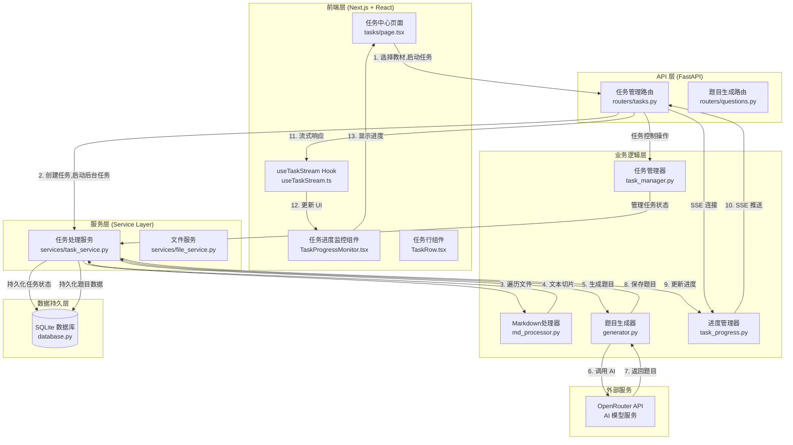
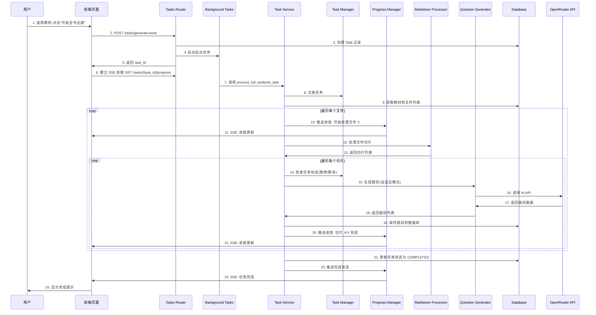
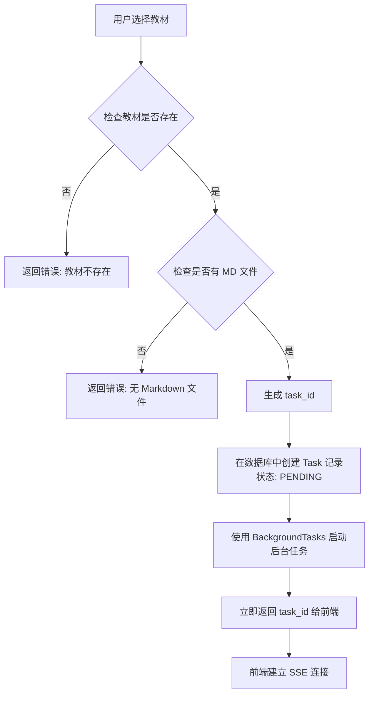
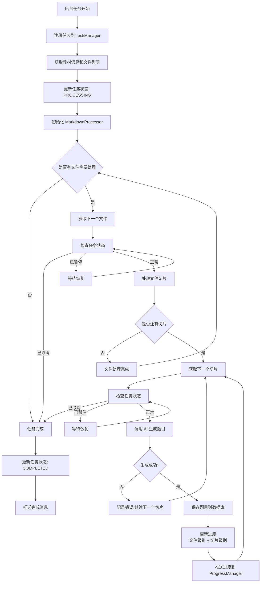
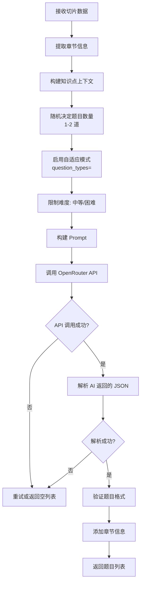
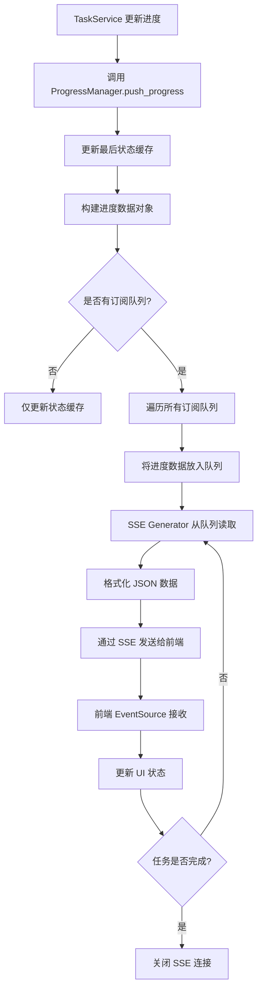
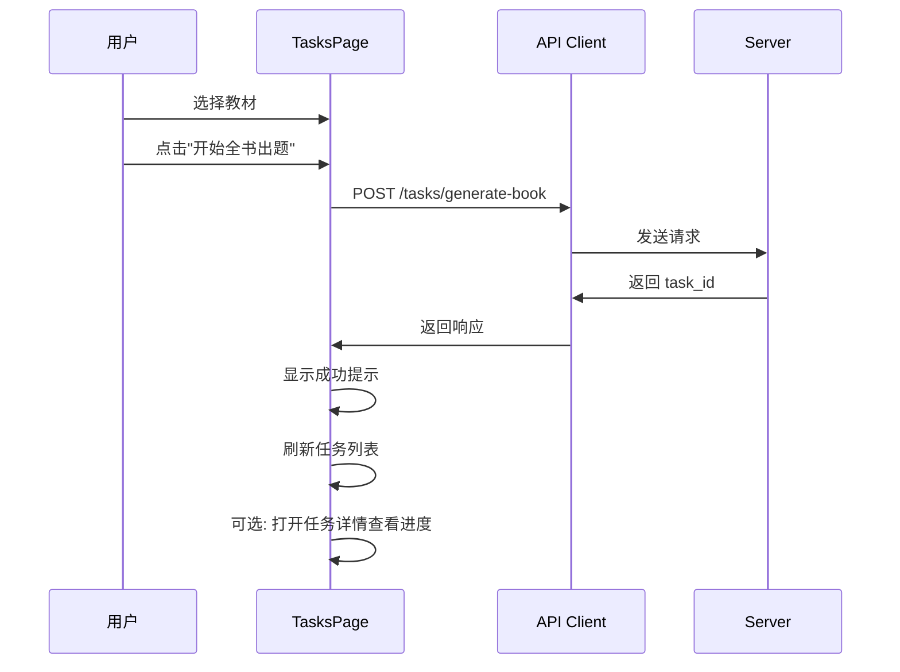
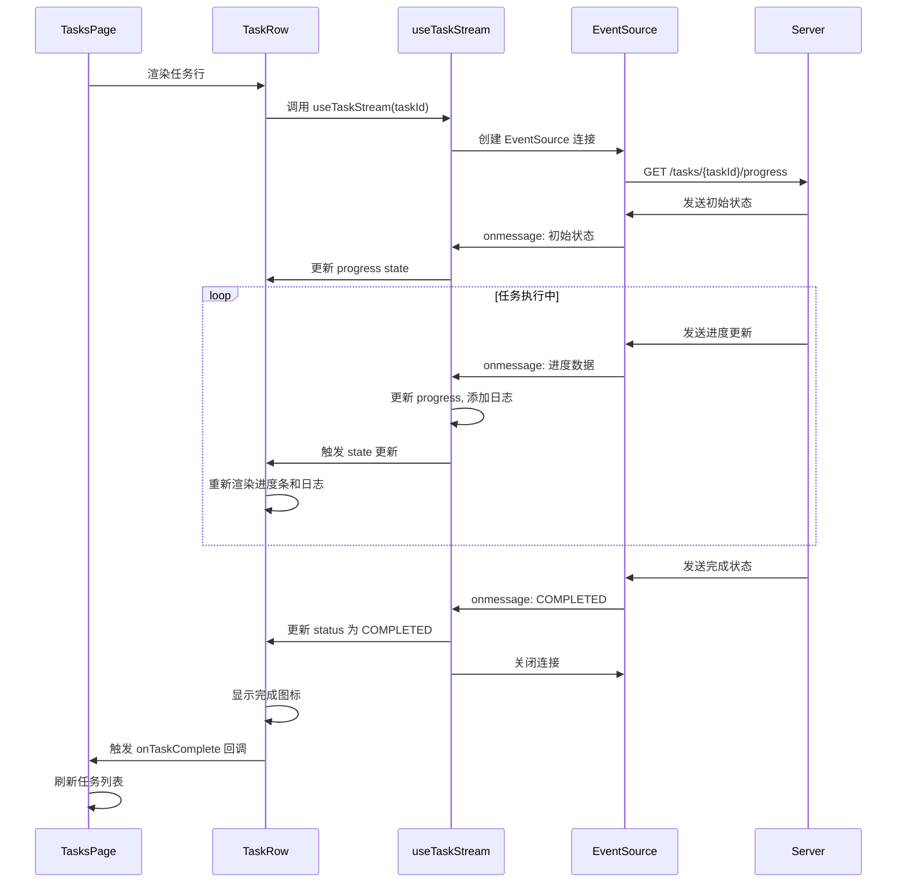
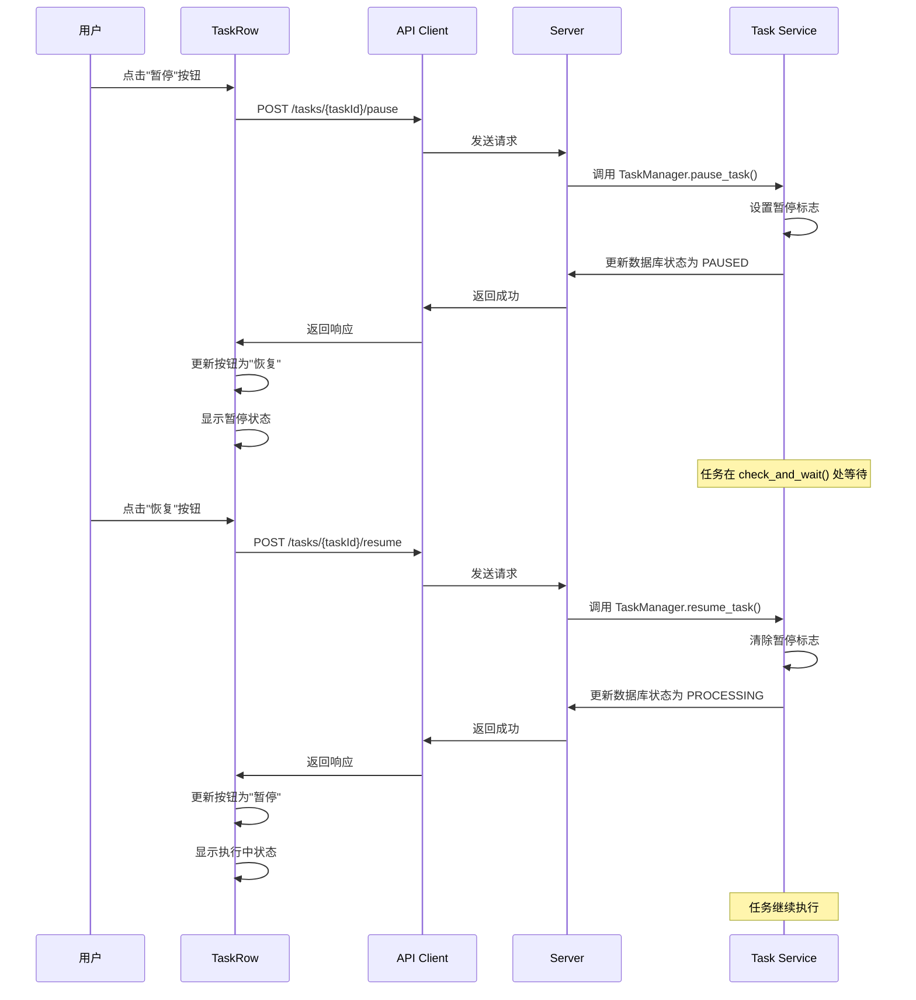

# 全书题目生成系统架构与流程文档

## 目录

1. [系统概述](#系统概述)
2. [系统架构图](#系统架构图)
3. [核心模块](#核心模块)
4. [完整流程](#完整流程)
5. [数据模型](#数据模型)
6. [API 接口](#api-接口)
7. [前端交互流程](#前端交互流程)
8. [关键技术点](#关键技术点)

---

## 系统概述

全书题目生成系统是 AI 计算机教材习题生成器的核心功能模块，负责自动化处理整本教材的所有 Markdown 文件，批量生成高质量题目，并实时反馈处理进度。

### 主要功能

1. **批量文件处理**：自动遍历教材下的所有 Markdown 文件
2. **智能题目生成**：基于知识点提取结果，自适应生成多种类型的题目
3. **实时进度追踪**：通过 SSE (Server-Sent Events) 实时推送任务进度
4. **任务生命周期管理**：支持任务的创建、暂停、恢复、取消等操作
5. **持久化存储**：将生成的题目保存到数据库，关联到对应的文件和教材

### 技术特点

- **异步处理**：使用 FastAPI BackgroundTasks 实现后台任务处理
- **流式推送**：基于 SSE 实现实时进度更新，无需轮询
- **状态管理**：完善的任务状态机，支持 PENDING → PROCESSING → COMPLETED/FAILED/CANCELLED
- **错误恢复**：单个文件处理失败不影响整体任务执行
- **自适应出题**：AI 根据知识点内容自动决定题型和数量

---

## 系统架构图

### 整体架构



### 模块交互流程



---

## 核心模块

### 后端模块

| 模块 | 文件路径 | 职责 | 关键方法 |
|------|---------|------|---------|
| **任务路由** | `backend/routers/tasks.py` | 提供任务管理 API 接口 | `generate_book()`, `get_task_progress()`, `pause_task()`, `resume_task()`, `cancel_task()` |
| **任务处理服务** | `backend/services/task_service.py` | 执行全书题目生成的核心业务逻辑 | `process_full_textbook_task()` |
| **任务管理器** | `backend/task_manager.py` | 管理任务生命周期，支持暂停/恢复/取消 | `register_task()`, `pause_task()`, `resume_task()`, `cancel_task()`, `check_and_wait()` |
| **进度管理器** | `backend/task_progress.py` | 管理任务进度推送队列，支持多客户端订阅 | `register_queue()`, `push_progress()`, `get_last_state()` |
| **Markdown 处理器** | `backend/md_processor.py` | 解析 Markdown 文件，按层级切片 | `process()`, `get_chapter_name()` |
| **题目生成器** | `backend/generator.py` | 调用 AI 生成题目 | `generate_questions_for_chunk()` |
| **数据库操作** | `backend/database.py` | 任务和题目的 CRUD 操作 | `create_task()`, `update_task()`, `store_question()`, `get_task()` |

### 前端模块

| 模块 | 文件路径 | 职责 | 关键功能 |
|------|---------|------|---------|
| **任务中心页面** | `frontend/app/tasks/page.tsx` | 任务列表展示和任务创建 | 教材选择、任务列表、任务操作 |
| **任务进度监控** | `frontend/components/TaskProgressMonitor.tsx` | 实时显示任务进度 | SSE 连接、进度条、日志显示 |
| **任务行组件** | `frontend/components/TaskRow.tsx` | 单个任务行的展示和操作 | 暂停/恢复/取消按钮、进度显示 |
| **任务流 Hook** | `frontend/hooks/useTaskStream.ts` | 封装 SSE 连接逻辑 | 自动重连、状态管理、日志记录 |

---

## 完整流程

### 1. 任务创建阶段



**关键代码位置**：
- `backend/routers/tasks.py:445-508` - `generate_book()` 函数

### 2. 任务执行阶段



**关键代码位置**：
- `backend/services/task_service.py:17-287` - `process_full_textbook_task()` 函数
- `backend/task_manager.py:152-173` - `check_and_wait()` 方法

### 3. 题目生成阶段



**关键代码位置**：
- `backend/generator.py:1884-1944` - `generate_questions_for_chunk()` 函数
- `backend/generator.py:1267-1371` - `_generate_batch()` 方法

### 4. 进度推送阶段



**关键代码位置**：
- `backend/task_progress.py:64-110` - `push_progress()` 方法
- `backend/routers/tasks.py:22-125` - `get_task_progress()` 函数

---

## 数据模型

### Task 数据模型

```python
{
    "task_id": str,              # UUID, 主键
    "textbook_id": str,          # 教材 ID, 外键
    "status": str,               # 状态: PENDING | PROCESSING | PAUSED | COMPLETED | FAILED | CANCELLED
    "progress": float,           # 进度: 0.0 - 1.0
    "current_file": str | None,  # 当前处理的文件名
    "total_files": int,          # 总文件数
    "error_message": str | None, # 错误消息（如果失败）
    "created_at": str,           # ISO 格式时间戳
    "updated_at": str            # ISO 格式时间戳
}
```

**数据库表结构**：
- 表名：`generation_tasks`
- 关键字段：`task_id` (PRIMARY KEY), `textbook_id`, `status`, `progress`, `current_file`

### Question 数据模型

```python
{
    "question_id": str,          # UUID, 主键
    "task_id": str,              # 关联的任务 ID
    "file_id": str,              # 关联的文件 ID
    "textbook_id": str,          # 关联的教材 ID
    "question_type": str,        # 题型: single_choice | multiple_choice | true_false | fill_blank
    "question": str,             # 题目内容
    "options": List[str],        # 选项列表（选择题）
    "correct_answer": str | List[str],  # 正确答案
    "explanation": str,          # 解析
    "difficulty": str,           # 难度: 简单 | 中等 | 困难
    "chapter": str | None,       # 章节名称
    "source_file": str,          # 源文件名
    "file_path": str,            # 文件路径
    "created_at": str            # ISO 格式时间戳
}
```

**数据库表结构**：
- 表名：`questions`
- 关键字段：`question_id` (PRIMARY KEY), `task_id`, `file_id`, `textbook_id`

### 进度推送数据模型

```python
{
    "status": str,               # 状态: connected | progress | COMPLETED | FAILED | CANCELLED
    "progress": float,           # 进度: 0.0 - 1.0
    "percentage": float,         # 百分比: 0.0 - 100.0
    "current_file": str | None,  # 当前处理的文件名
    "message": str | None,       # 进度消息
    "timestamp": str             # ISO 格式时间戳
}
```

---

## API 接口

### 1. 启动全书题目生成

**接口**: `POST /tasks/generate-book`

**请求体**:
```json
{
    "textbook_id": "uuid-string"
}
```

**响应**:
```json
{
    "message": "任务已启动",
    "task_id": "uuid-string",
    "task": {
        "task_id": "uuid-string",
        "textbook_id": "uuid-string",
        "status": "PENDING",
        "progress": 0.0,
        "total_files": 10,
        ...
    }
}
```

### 2. 获取任务进度 (SSE)

**接口**: `GET /tasks/{task_id}/progress`

**响应类型**: `text/event-stream`

**事件格式**:
```
data: {"status": "connected", "progress": 0.0, "percentage": 0.0, ...}

data: {"status": "progress", "progress": 0.35, "percentage": 35.0, "current_file": "第二章.md", ...}

data: {"status": "COMPLETED", "progress": 1.0, "percentage": 100.0, ...}
```

### 3. 获取任务详情

**接口**: `GET /tasks/{task_id}`

**响应**:
```json
{
    "task_id": "uuid-string",
    "textbook_id": "uuid-string",
    "status": "PROCESSING",
    "progress": 0.35,
    "current_file": "第二章.md",
    "total_files": 10,
    ...
}
```

### 4. 获取任务列表

**接口**: `GET /tasks?textbook_id={textbook_id}&status={status}&limit={limit}&offset={offset}`

**响应**:
```json
[
    {
        "task_id": "uuid-string",
        "textbook_id": "uuid-string",
        "status": "COMPLETED",
        "progress": 1.0,
        ...
    },
    ...
]
```

### 5. 暂停任务

**接口**: `POST /tasks/{task_id}/pause`

**响应**:
```json
{
    "message": "任务已暂停",
    "task_id": "uuid-string",
    "status": "PAUSED"
}
```

### 6. 恢复任务

**接口**: `POST /tasks/{task_id}/resume`

**响应**:
```json
{
    "message": "任务已恢复",
    "task_id": "uuid-string",
    "status": "PROCESSING"
}
```

### 7. 取消任务

**接口**: `POST /tasks/{task_id}/cancel`

**响应**:
```json
{
    "message": "任务已取消",
    "task_id": "uuid-string",
    "status": "CANCELLED"
}
```

---

## 前端交互流程

### 1. 任务创建流程



### 2. 进度监控流程



### 3. 任务控制流程



---

## 关键技术点

### 1. 异步任务处理

**技术选型**: FastAPI BackgroundTasks

**优势**:
- 简单易用，无需额外依赖（如 Celery）
- 与 FastAPI 无缝集成
- 适合中小规模任务

**实现要点**:
```python
# backend/routers/tasks.py
background_tasks.add_task(process_full_textbook_task, task_id)
```

### 2. Server-Sent Events (SSE)

**技术选型**: FastAPI StreamingResponse + asyncio.Queue

**实现架构**:
- `TaskProgressManager`: 管理进度队列，支持多客户端订阅
- `asyncio.Queue`: 每个客户端连接对应一个队列
- `StreamingResponse`: FastAPI 流式响应，发送 SSE 格式数据

**关键代码**:
```python
# backend/task_progress.py
async def push_progress(self, task_id: str, progress: float, ...):
    # 推送到所有订阅的队列
    for queue in self._task_queues[task_id]:
        await queue.put(progress_data)

# backend/routers/tasks.py
async def progress_generator():
    progress_queue = await task_progress_manager.register_queue(task_id)
    while True:
        progress_data = await progress_queue.get()
        yield f"data: {json.dumps(progress_data)}{newline}{newline}"
```

### 3. 任务状态管理

**状态机设计**:
```
PENDING → PROCESSING → COMPLETED
              ↓
           PAUSED (可恢复)
              ↓
          CANCELLED
              ↓
           FAILED
```

**实现机制**:
- `TaskManager`: 使用 `asyncio.Event` 实现暂停/恢复
- `check_and_wait()`: 在每个关键点检查任务状态
- 数据库持久化: 任务状态保存在数据库中，支持服务重启后恢复

### 4. 自适应题目生成

**策略**:
- 每个切片随机生成 1-2 道题目
- 不指定题型，让 AI 自主选择最适合的题型
- 限制难度为中等或困难，避免过于简单的题目

**实现**:
```python
# backend/generator.py
question_count = random.randint(1, 2)
questions_data = await client._generate_batch(
    context=context,
    batch_question_types=[],  # 空列表启用自适应模式
    batch_count=question_count,
    allowed_difficulties=["中等", "困难"]
)
```

### 5. 进度计算

**两级进度计算**:
- **文件级别进度**: `(file_index - 1) / total_files`
- **切片级别进度**: `chunk_index / total_chunks`
- **总体进度**: `文件级别进度 + (切片级别进度 / total_files)`

**公式**:
```
总体进度 = (file_index - 1) / total_files + (chunk_index / total_chunks) / total_files
```

### 6. 错误处理与容错

**策略**:
- 单个切片生成失败不影响其他切片
- 单个文件处理失败不影响其他文件
- 任务级别的错误会标记整个任务为 FAILED
- 所有错误都会记录到日志和数据库

**实现**:
```python
# backend/services/task_service.py
try:
    questions_data = await generate_questions_for_chunk(chunk, ...)
    # 保存题目
except Exception as e:
    print(f"警告：切片生成题目失败: {e}")
    continue  # 继续处理下一个切片
```

### 7. 性能优化

**限流控制**:
- 每个切片生成后添加 0.5 秒延迟，避免 API 限流
- 未来可改进为令牌桶算法

**资源管理**:
- SSE 连接断开时自动清理队列
- 任务完成后保留状态一段时间，便于新连接获取最后状态

---

## 总结

全书题目生成系统采用了清晰的**分层架构**和**异步处理**机制，实现了高效的批量题目生成功能。通过 **SSE 实时推送**、**完善的任务管理**和**自适应出题策略**，系统能够在处理大规模教材时保持良好的用户体验和系统稳定性。

### 设计亮点

1. ✅ **职责分离**: 路由层、服务层、业务逻辑层清晰划分
2. ✅ **实时反馈**: SSE 流式推送，用户体验优秀
3. ✅ **状态管理**: 完善的任务状态机，支持暂停/恢复/取消
4. ✅ **容错机制**: 单个失败不影响整体，任务可恢复
5. ✅ **可扩展性**: 模块化设计，易于扩展新功能

### 未来改进方向

1. 🔄 **令牌桶限流**: 替换简单延迟，实现更智能的 API 限流
2. 🔄 **任务优先级**: 支持任务优先级队列
3. 🔄 **并发控制**: 支持多个任务并发执行（需考虑资源限制）
4. 🔄 **断点续传**: 优化任务恢复逻辑，支持更精确的断点续传
5. 🔄 **批量优化**: 优化题目生成逻辑，支持批量生成以提高效率

